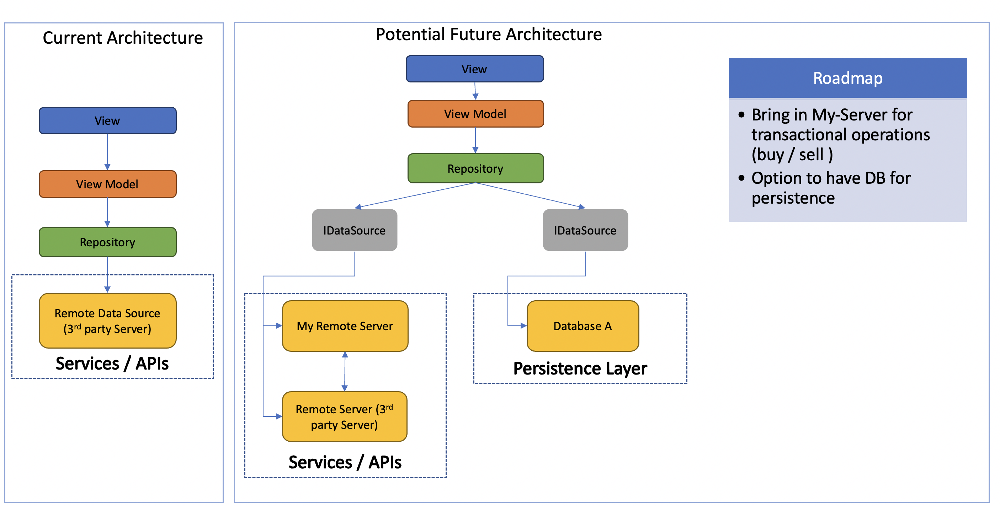

# CryptoCurrency

In this app,

1. When the user opens the app, it displays a list of crypto currency assets displaying the asset name and symbol.

2. When the user taps on an asset, it navigates to a new Fragment where it displays detailed view of one Market of the selected crypto currency. It displays only the one with the highest volume transacted in the last 24 hours. The information displayed is:
	  Exchange ID
	  Rank
	  Price
	  Updated date with the format "Day/Month/Year"
    
    
MVVM architecture has been followed in this app 

Hilt – for dependency Injection

Coroutines – for structured concurrency

Retrofit – for networking

Http Caching - to reduce the bandwidth and increase end user experience

Sealed Class – for easy network error handling

By making use of the Jetpack architecture components - LiveData, Navigation, ViewModel and Coroutines, separation of concerns, testability, loose coupling, Observer Pattern and Inversion of Control has been achieved.

In terms of scalability, for instance, if in the future one decides to bring in another source of data(i.e implement one’s own server or so) then it could be easily implemented( make use of polymorphism). Thus one could create as many sources as needed.

